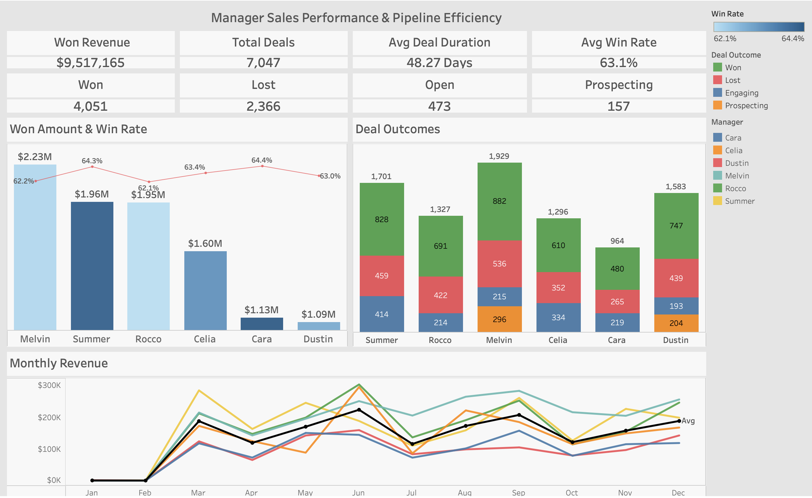
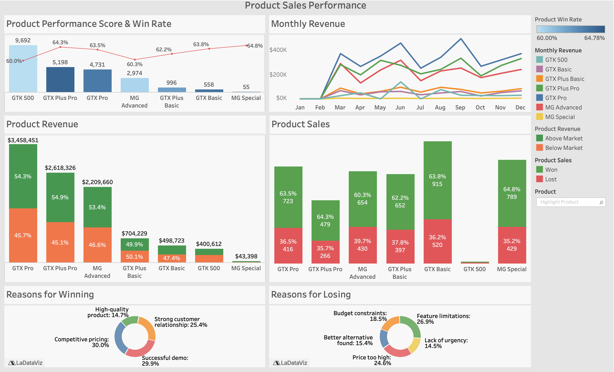
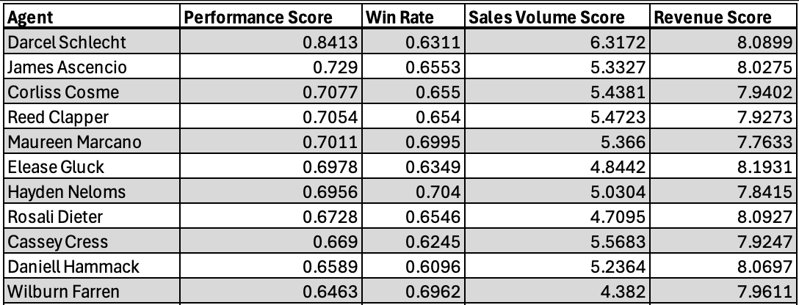

## 🟦 Project Background

MavenTech is a company that specializes in selling computer hardware to large businesses. The organization recently implemented a CRM system to track sales opportunities across its pipeline; however, it lacks visibility into the data outside of the platform, making it difficult to evaluate sales performance and identify areas for improvement.

The dataset used in this project consists of CRM records from October 2016 to December 2017, containing detailed information on sales opportunities, including deal stages, product categories, account information, sales ownership, and deal outcomes (Won or Lost).

Without structured analysis, MavenTech is unable to answer critical business questions such as:
- Where deals are getting stuck in the pipeline  
- Which sales agents or products are driving revenue  
- How effectively opportunities are being converted into closed deals  

#### **Overall Goal: Improve the conversion, consistency, and scalability of high-value opportunities to drive predictable and profitable revenue growth.**

This project aims to bridge that gap by transforming raw CRM data into actionable insights that provide clarity into pipeline health, sales performance, and overall business efficiency through the use of **Excel, SQL, and Tableau**.

The dashboards provide a high-level view of performance trends, while SQL enables deeper diagnostic analysis:

- Dashboards highlight **where performance varies**  
- SQL explains **why those differences exist**  

Together, they enable both **monitoring and decision-making**, bridging the gap between reporting and strategy.

> **Note:** Detailed recommendations and implementation actions are consolidated in the final section of this report.

---

Targeted SQL Queries regarding various business questions can be found [here](https://github.com/a-paija/CRM-Sales-Opportunities/blob/main/SQL_CRM_Pipeline_Analysis.sql)

The SQL queries used to inspect and perform quality checks can be found [here](https://github.com/a-paija/CRM-Sales-Opportunities/blob/main/Exploratory%20Data%20Analysis.sql)

An interactive Tableau Dashboard can be found [here](https://public.tableau.com/app/profile/ajin.paija/viz/SalesPerformancePricingAnalytics/Story1)

---

## 🟦 Business Objective and Data Structure

The primary objective of this analysis is to evaluate the effectiveness of MavenTech’s sales pipeline and identify opportunities to improve conversion rates, revenue generation, and sales efficiency.

Specifically, this project seeks to:

1. Assess pipeline health and identify bottlenecks
2. Measure win rate and conversion performance
3. Analyze revenue contribution across agents, managers, and products
4. Evaluate sales cycle efficiency
5. Identify trends in deal activity over time

## 🟦 Data Structure & Initial Checks

MavenTech's database structure as seen below consists of four tables: sales_pipeline, sales_team, account, and product, with a total row count of 8,800 records. Each record represents a single deal (opportunity) with associated attributes describing its progression, ownership, and outcome.

## 🟦 Data Cleaning (Excel)

Before analysis, data quality checks were conducted to ensure accuracy and build familiarity with the dataset. Key observations, data issues, and inconsistencies were documented in an issue log, using excel pivot tables, while potential outliers and anomalies were identified and flagged for further review.

Excel was then used to clean and prepare the dataset for analysis in SQL. This included handling missing values, standardizing categorical fields such as deal stages, and ensuring consistent formats for dates and numerical values. These steps ensured the data could be efficiently imported into SQL and enabled accurate querying and analysis. Below is an image of the flagged data found during the data cleaning phase.

## 🟩 Executive Summary

MavenTech has generated approximately **$9.5M in total revenue**, supported by a solid **63% overall win rate**, indicating a generally healthy pipeline at a surface level. However, deeper analysis reveals that performance is **structurally inconsistent, highly concentrated, and operationally inefficient in key areas of the sales process**.

Revenue generation is heavily dependent on **irregular high-value deal closures**, resulting in significant monthly volatility and limiting forecast reliability. At the same time, over **83% of revenue is concentrated in just three products**, increasing dependency risk and constraining scalable growth.

Most critically, the business is losing approximately **$5.9M in potential revenue**, not due to lack of demand, but due to **conversion inefficiencies in high-value opportunities**—the segment where the company is otherwise strongest.

Additionally, a **3.4x performance gap across sales agents** and inconsistent discounting practices indicate that **execution quality and pricing discipline vary significantly across the organization**, further impacting revenue realization and margin performance.

Together, these findings point to a core issue:

> **MavenTech’s primary constraint is not pipeline generation, but the ability to consistently convert, distribute, and scale high-value opportunities efficiently.**

Addressing these gaps represents a significant opportunity to unlock near-term revenue gains while improving long-term scalability and predictability.

---

Below is the Manager & Sales Pipeline Efficiency page from the Tableau Visualization and more examples will be included throughout the report. The entire interactive Tableau Dashboard can be found [here](https://public.tableau.com/app/profile/ajin.paija/viz/SalesPerformancePricingAnalytics/Story1)

## 🟨 Sales Trends & Revenue Momentum

Monthly revenue trends reveal a pattern of **inconsistent performance rather than steady growth**, with total annual revenue of approximately **$9.5M**. Average monthly revenue is estimated at **~$790K**, though actual performance varies significantly due to pronounced peaks and troughs throughout the year.

Peak months outperform the average by a substantial margin, often driven by **high-value enterprise deal closures and end-of-period acceleration**, with top-performing months generating approximately **1.5x–2x the average monthly revenue**. In contrast, lower-performing months fall well below the mean, highlighting **gaps in pipeline coverage and uneven deal distribution**.

This spread between high and low months indicates that revenue performance is **heavily dependent on the timing of large deal closures rather than consistent deal flow**, introducing volatility that impacts **forecast accuracy, capacity planning, and resource allocation**.

#### **Insights:**
Revenue generation is structurally **volatile and timing-dependent**, with performance driven more by **irregular high-value deal closures than by a stable and repeatable pipeline engine**, limiting predictability and scalability.

## 🟨 Regional Performance Insights (SQL)

Revenue distribution across regions is relatively balanced, with the **West leading at $3.56M**, followed by the **Central region at $3.32M**, and the **East at $3.08M**.

However, each region demonstrates a distinct performance profile:

- The **West** leads in overall revenue scale  
- The **Central region** generates higher deal volume but lower efficiency  
- The **East region** achieves the **highest average deal size (~$2,637)**  

This indicates that while total revenue contribution is similar, **deal quality and sales efficiency vary significantly by region**, with the East demonstrating stronger monetization per opportunity.

#### **Insights:**
Regional performance is not uniform—**revenue quality differs materially**, with the East operating as a **high-value, lower-volume model**, while other regions rely more on scale, signaling an opportunity to rebalance toward higher-value deal strategies.

## 🟨 Product Overview

Below is an overview of Product Performance from the Tableau Visualisations. The entire interactive Tableau Dashboard can be found [here](https://public.tableau.com/app/profile/ajin.paija/viz/SalesPerformancePricingAnalytics/Story1)

## 🟨 Product Performance & Revenue Concentration (Tableau)

Revenue is heavily concentrated in three products:

- **GTX Pro (~$3.46M)**  
- **GTX Plus Pro (~$2.62M)**  
- **MG Advanced (~$2.21M)**  

Together, these products account for approximately **83% of total revenue**, indicating strong product-market fit within a narrow segment of the portfolio.

However, this level of concentration introduces **dependency risk**, as overall business performance is disproportionately tied to a small subset of offerings, limiting diversification and resilience.

#### **Insights:**
Revenue concentration reflects **strong top-product performance but weak portfolio balance**, making growth highly dependent on a limited number of products rather than a diversified and scalable product mix.

## 🟧 Revenue Leakage & Conversion Gaps (SQL)

Despite strong revenue generation, the business is losing approximately **$5.9M in potential revenue**, largely from its highest-performing products:

- GTX Pro: **~$2.0M lost revenue**  
- MG Advanced: **~$1.46M lost revenue**  
- GTX Plus Pro: **~$1.46M lost revenue**

This indicates that **demand and pipeline generation are not the primary constraints**. Instead, the business is underperforming in **converting high-value opportunities into closed revenue**.

Even a modest **10% improvement in conversion rates** across these products could yield an estimated **$600K+ in incremental revenue**, highlighting the magnitude of this inefficiency.

#### **Insights:**
The primary growth constraint is **conversion inefficiency at the high-value end of the pipeline**, where the business is already strongest, making this the **highest-impact lever for near-term revenue expansion**.

## 🟧 Pricing Strategy & Discounting Behavior (SQL)

Pricing analysis reveals clear segmentation across product tiers:

- **Premium products (e.g., GTX Plus Pro)** demonstrate strong pricing power, occasionally selling **above list price (~+$7)**  
- Core products (GTX Pro, MG Advanced) remain stable and close to list price  
- Lower-tier and high-ticket products rely heavily on discounting:
  - GTX Plus Basic: **~-$15.89 below list price**  
  - GTK 500: **~-$60.53 below list price**

This suggests inconsistent pricing discipline, where discounting is selectively applied but not always strategically justified.

#### **Insights:**
While pricing power exists in premium segments, **inconsistent discounting practices elsewhere indicate reliance on price reductions to close deals**, potentially eroding margins and masking underlying sales execution gaps.

## 🟥 Agent Sales Performance Score (SQL)

A weighted performance model incorporating win rate, deal volume, and revenue reveals scores ranging from **0.248 to 0.841**, representing a **3.4x gap between top and bottom performers**.

Top-performing agents (scores **~0.70–0.84**) consistently combine **strong win rates (0.63–0.70)** with above-average deal volume and revenue contribution. Notably, the highest performer (0.8413) does not have the highest win rate, but leads in **sales volume and revenue generation**, reinforcing that performance is driven by a **balanced combination of efficiency and output**.

In contrast, lower-performing agents (scores **~0.25–0.50**) often exhibit **comparable win rates** but underperform in **deal volume or revenue**, suggesting that activity alone is insufficient without effective value capture.

#### **Insights:**
Performance variation is driven less by win rate differences and more by **inconsistent ability to generate and convert high-value opportunities**, highlighting execution gaps in **revenue productivity, not just sales activity**.

## 🟩 Strategic Recommendations & Actions

### **1. Improve Revenue Consistency & Forecast Accuracy**
Revenue volatility—driven by reliance on large, irregular deal closures—limits predictability and weakens operational planning.

**Actions:**
- Increase **pipeline coverage ratio** to stabilize monthly revenue output  
- Improve **deal distribution across time** to reduce end-of-period concentration  
- Incorporate **historical volatility patterns into forecasting models**  

### **2. Close High-Value Conversion Gaps**
With approximately **$5.9M in unrealized revenue**, the primary growth constraint is **ineffective conversion of high-value opportunities**, not demand generation.

**Actions:**
- Prioritize **late-stage pipeline management and deal support**  
- Identify and eliminate **conversion bottlenecks in top-performing products**  
- Focus on improving **close rates for high-value, late-stage deals**  

### **3. Reduce Product Concentration Risk**
Over **83% of revenue** is driven by three products, increasing dependency and limiting long-term scalability.

**Actions:**
- Expand focus on **mid-tier and underutilized products**  
- Diversify revenue streams to reduce reliance on top performers  
- Replicate successful **go-to-market strategies across a broader product set**  

### **4. Strengthen Pricing Discipline**
Inconsistent discounting behavior suggests missed opportunities to maximize margin and reinforce product value.

**Actions:**
- Standardize **discounting guidelines and approval thresholds**  
- Reinforce **value-based selling practices across sales teams**  
- Align pricing strategy with **product positioning and demand strength**  

### **5. Elevate Sales Execution Through Performance Optimization**
A **3.4x performance gap across agents** highlights inconsistent execution and uneven revenue productivity.

**Actions:**
- Shift performance evaluation toward **composite metrics (revenue, volume, win rate)**  
- Use top performers to define **replicable best practices and playbooks**  
- Target coaching for agents with **strong win rates but low revenue output**  
